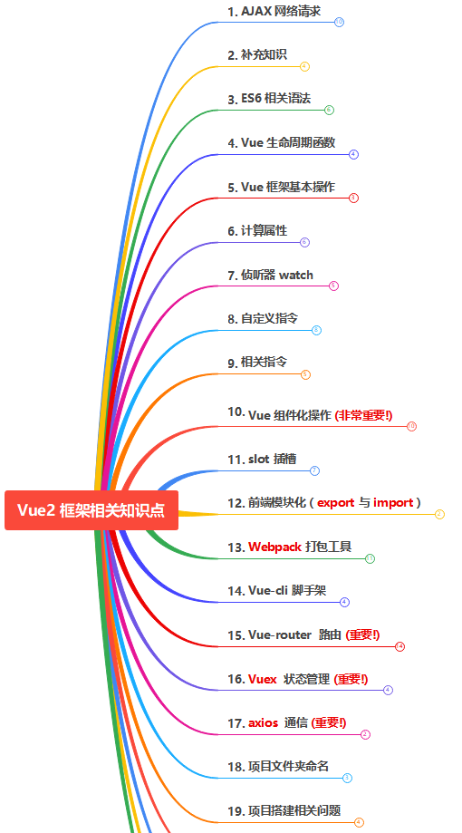
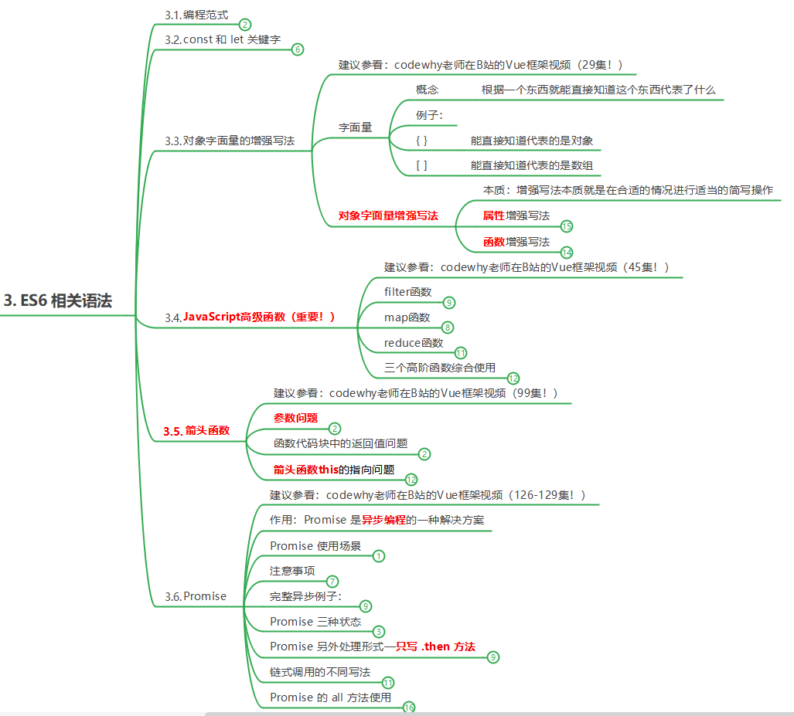
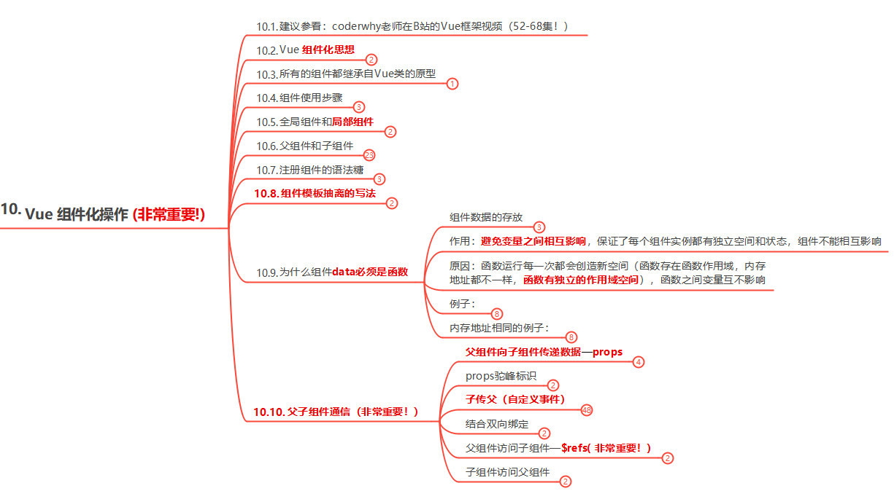
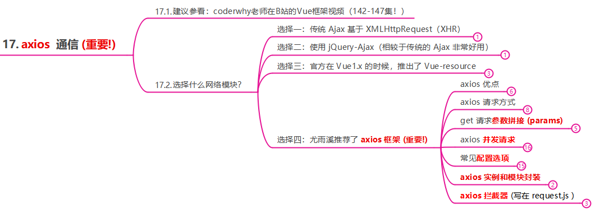

# Vue2 知识点思维导图
你好，我是itchao，欢迎你来到我的【Vue2 知识点思维导图】仓库。

本仓库内容是根据B站coderwhy老师的视频课程[《最全最新Vue、Vuejs教程，从入门到精通》](https://www.bilibili.com/video/BV15741177Eh?spm_id_from=333.999.0.0)整理的一份非常详细的知识点思维导图（已获老师授权），按照视频课程的顺序进行了知识点梳理，课程讲的非常好，非常感谢coderwhy老师。欢迎大家在观看视频教程的同时，结合该思维导图一起回顾知识，学习效果更佳哦！如果你觉得该思维导图对你有帮助，给我点一个Star❤ 把，我会很开心的，也会激励我继续完善优化该思维导图，谢谢！
**在线预览地址：https://www.edrawsoft.cn/viewer/public/s/9b133278907274**

**注意：该思维导图是 emmx 文件，需要下载 MindMaster 思维导图软件才能打开！** 
**MindMaster 下载官方地址：https://www.edrawsoft.cn/download/**

该思维导图是我上传的第一版，还存在很多不足之处，需要完善和修改，有相关更好建议的朋友可以直接给我发 Issues，以后有时间我会继续优化完善该思维导图。

觉得有帮助的，给我点个 Star❤ 哦！我看到你们点的 Star❤ ，我一定会非常开心的！

谢谢大家！特别感谢coderwhy老师！

作者：itchao

2021年10月22日01:57:55

***
## 思维导图示例:(一定要下载 MindMaster 思维导图软件才能打开)
### 1. 大纲:

***
### 2. ES6 相关语法:

### 3. 组件化操作:

***
### 4. Vue-router:

***
### 5. axios:

